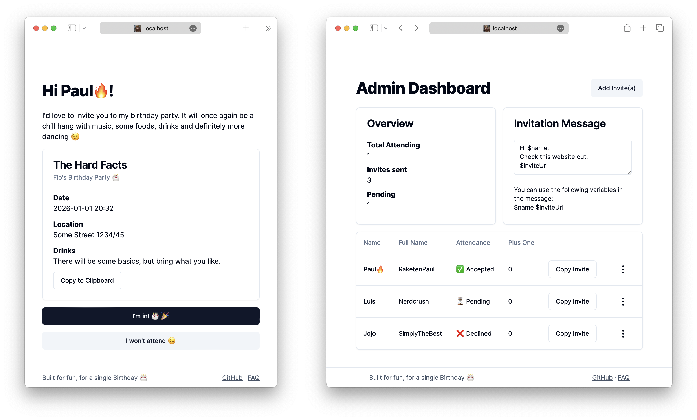

# birthdaiii 🎂

An over engineered invitation management website.



## Run it yourself
```
npm install
cp birthdaiii-example.json birthdaiii.json
npx prisma db push
npm run dev
```

**Note:** Don't use that server in production, it is built for development comfort. For production run `npm run build && npm run start`.

## Configuration

Since this is a personal project only intended for me some information is hard coded into the website. However, I didn't wanted to dox myself so I left my home address and date out of the source code. They are defined in `birhtdaiii.json` and dynamically read (hot reloadable). 

The real configuration file is obviously not part of this repo but I provided a example file with `birthdaiii-example.json`.

## Usage

First, you will need to create some invites on the admin page. The adminpage is at `/admin/{secret}` with the secret being defined in `bithdaiii.json`.

From there usage should be clear, to copy the invites, you must first define a invite message in the admin page. You can also just copy the invite url.

## How I deploy

The webserver is deployed on a Linux server I rent and deployed as a systemd user service. You can see it's configuration in `birthdaiii.service`.